## 1. 流程图 Flowchart

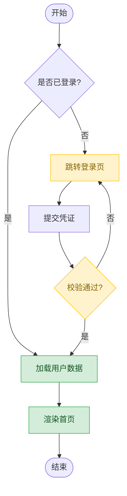
```mermaid
flowchart TD
    A([开始]) --> B{是否已登录?}
    B -- 是 --> C[加载用户数据]
    B -- 否 --> D[跳转登录页]
    D --> E[提交凭证]
    E --> F{校验通过?}
    F -- 否 --> D
    F -- 是 --> C
    C --> G[渲染首页]
    G --> H([结束])

    classDef ok fill:#d4edda,stroke:#28a745,color:#155724
    classDef warn fill:#fff3cd,stroke:#ffc107,color:#856404
    class C,G ok
    class D,F warn
```

### 1.1 子图与方向

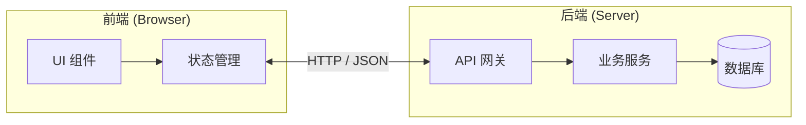
```mermaid
flowchart LR
    subgraph 前端["前端 (Browser)"]
        direction TB
        UI[UI 组件] --> Store[状态管理]
    end

    subgraph 后端["后端 (Server)"]
        direction TB
        API[API 网关] --> SVC[业务服务]
        SVC --> DB[(数据库)]
    end

    Store <-->|HTTP / JSON| API
```

### 1.2 其他图形节点

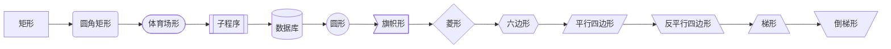
```mermaid
flowchart LR
    A[矩形] --> B(圆角矩形)
    B --> C([体育场形])
    C --> D[[子程序]]
    D --> E[(数据库)]
    E --> F((圆形))
    F --> G>旗帜形]
    G --> H{菱形}
    H --> I{{六边形}}
    I --> J[/平行四边形/]
    J --> K[\反平行四边形\]
    K --> L[/梯形\]
    L --> M[\倒梯形/]
```

---

## 2. 时序图 SequenceDiagram

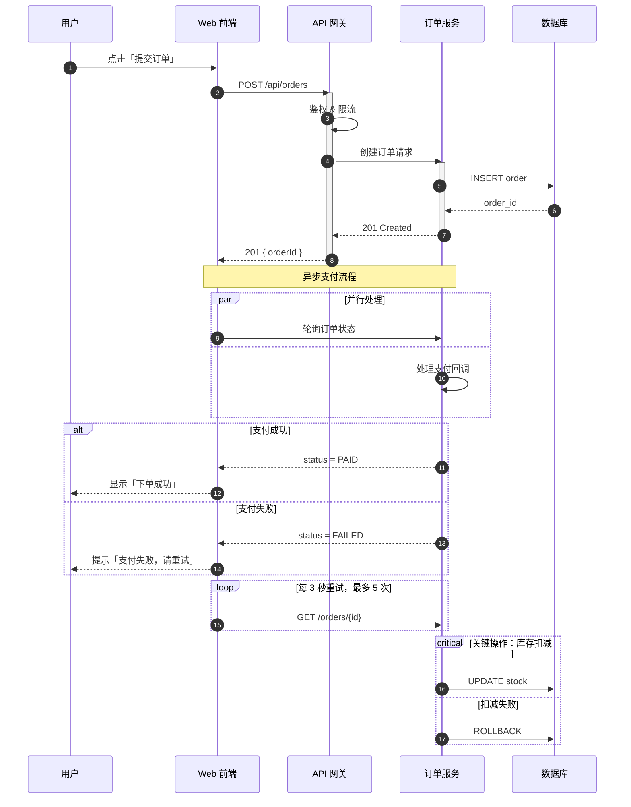
```mermaid
sequenceDiagram
    autonumber
    participant U as 用户
    participant W as Web 前端
    participant A as API 网关
    participant S as 订单服务
    participant DB as 数据库

    U->>W: 点击「提交订单」
    W->>A: POST /api/orders
    activate A
    A->>A: 鉴权 & 限流
    A->>S: 创建订单请求
    activate S
    S->>DB: INSERT order
    DB-->>S: order_id
    S-->>A: 201 Created
    deactivate S
    A-->>W: 201 { orderId }
    deactivate A

    Note over W,S: 异步支付流程

    par 并行处理
        W->>S: 轮询订单状态
    and
        S->>S: 处理支付回调
    end

    alt 支付成功
        S-->>W: status = PAID
        W-->>U: 显示「下单成功」
    else 支付失败
        S-->>W: status = FAILED
        W-->>U: 提示「支付失败，请重试」
    end

    loop 每 3 秒重试，最多 5 次
        W->>S: GET /orders/{id}
    end

    critical 关键操作：库存扣减
        S->>DB: UPDATE stock
    option 扣减失败
        S->>DB: ROLLBACK
    end
```

---

## 3. 类图 ClassDiagram

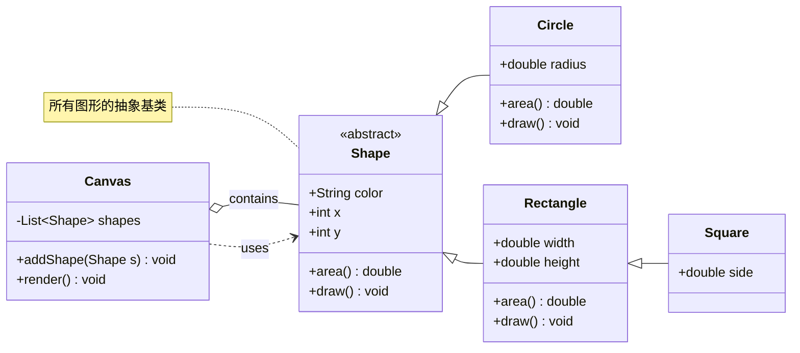
```mermaid
classDiagram
    direction LR

    class Shape {
        <<abstract>>
        +String color
        +int x
        +int y
        +area() double
        +draw() void
    }

    class Circle {
        +double radius
        +area() double
        +draw() void
    }

    class Rectangle {
        +double width
        +double height
        +area() double
        +draw() void
    }

    class Square {
        +double side
    }

    class Canvas {
        -List~Shape~ shapes
        +addShape(Shape s) void
        +render() void
    }

    Shape <|-- Circle
    Shape <|-- Rectangle
    Rectangle <|-- Square
    Canvas o-- Shape : contains
    Canvas ..> Shape : uses

    note for Shape "所有图形的抽象基类"
```

---

## 4. 状态图 StateDiagram v2

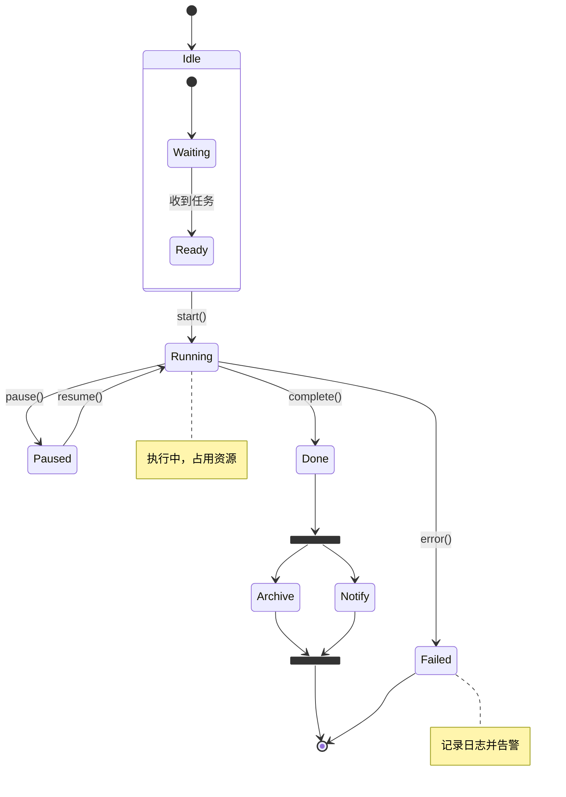
```mermaid
stateDiagram-v2
    [*] --> Idle

    state Idle {
        [*] --> Waiting
        Waiting --> Ready : 收到任务
    }

    Idle --> Running : start()
    Running --> Paused : pause()
    Paused --> Running : resume()
    Running --> Done : complete()
    Running --> Failed : error()

    state fork_state <<fork>>
    Done --> fork_state
    fork_state --> Archive
    fork_state --> Notify

    state join_state <<join>>
    Archive --> join_state
    Notify --> join_state
    join_state --> [*]

    Failed --> [*]

    note right of Running : 执行中，占用资源
    note right of Failed : 记录日志并告警
```

---

## 5. 实体关系图 ERDiagram

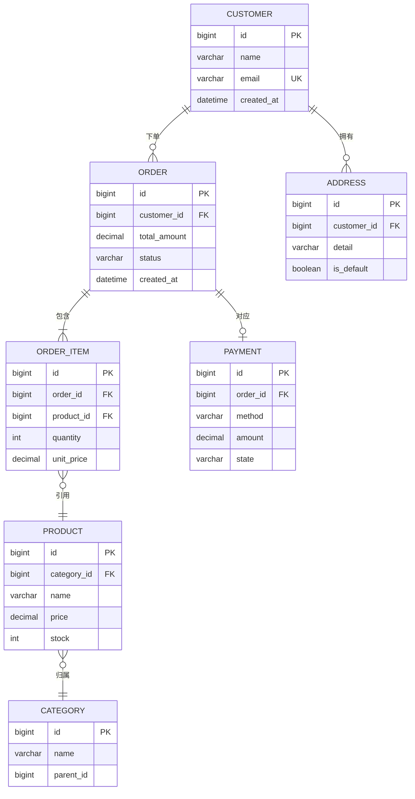
```mermaid
erDiagram
    CUSTOMER ||--o{ ORDER : "下单"
    CUSTOMER ||--o{ ADDRESS : "拥有"
    ORDER ||--|{ ORDER_ITEM : "包含"
    ORDER ||--o| PAYMENT : "对应"
    ORDER_ITEM }o--|| PRODUCT : "引用"
    PRODUCT }o--|| CATEGORY : "归属"

    CUSTOMER {
        bigint id PK
        varchar name
        varchar email UK
        datetime created_at
    }

    ADDRESS {
        bigint id PK
        bigint customer_id FK
        varchar detail
        boolean is_default
    }

    ORDER {
        bigint id PK
        bigint customer_id FK
        decimal total_amount
        varchar status
        datetime created_at
    }

    ORDER_ITEM {
        bigint id PK
        bigint order_id FK
        bigint product_id FK
        int quantity
        decimal unit_price
    }

    PAYMENT {
        bigint id PK
        bigint order_id FK
        varchar method
        decimal amount
        varchar state
    }

    PRODUCT {
        bigint id PK
        bigint category_id FK
        varchar name
        decimal price
        int stock
    }

    CATEGORY {
        bigint id PK
        varchar name
        bigint parent_id
    }
```

---

## 6. 用户旅程图 Journey

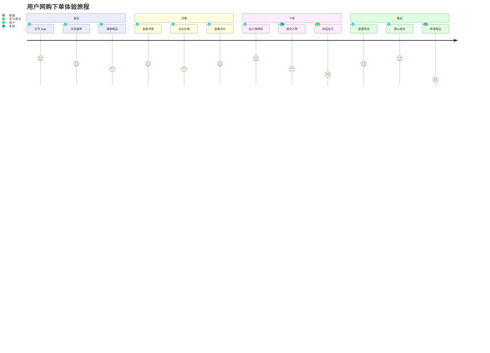
```mermaid
journey
    title 用户网购下单体验旅程
    section 发现
      打开 App: 5: 用户
      浏览推荐: 4: 用户
      搜索商品: 3: 用户
    section 决策
      查看详情: 4: 用户
      对比价格: 3: 用户
      查看评价: 4: 用户
    section 下单
      加入购物车: 5: 用户
      提交订单: 3: 用户, 系统
      完成支付: 2: 用户, 支付网关
    section 售后
      查看物流: 4: 用户
      确认收货: 5: 用户
      申请售后: 1: 用户, 客服
```

---

## 7. 甘特图 Gantt

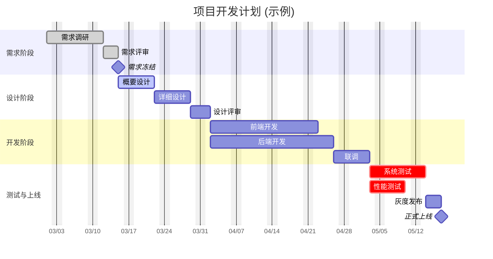
```mermaid
gantt
    title 项目开发计划 (示例)
    dateFormat  YYYY-MM-DD
    axisFormat  %m/%d
    excludes    weekends

    section 需求阶段
    需求调研           :done,    req1, 2024-03-01, 7d
    需求评审           :done,    req2, after req1, 3d
    需求冻结           :milestone, m1, after req2, 0d

    section 设计阶段
    概要设计           :active,  des1, after req2, 5d
    详细设计           :         des2, after des1, 5d
    设计评审           :         des3, after des2, 2d

    section 开发阶段
    前端开发           :         dev1, after des3, 15d
    后端开发           :         dev2, after des3, 18d
    联调               :         dev3, after dev2, 5d

    section 测试与上线
    系统测试           :crit,    qa1, after dev3, 7d
    性能测试           :crit,    qa2, after dev3, 5d
    灰度发布           :         rel1, after qa1, 3d
    正式上线           :milestone, m2, after rel1, 0d
```

---

## 8. 饼图 Pie

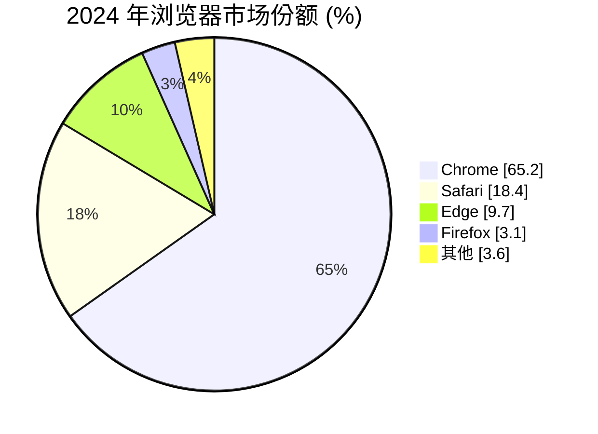
```mermaid
pie showData
    title 2024 年浏览器市场份额 (%)
    "Chrome"  : 65.2
    "Safari"  : 18.4
    "Edge"    : 9.7
    "Firefox" : 3.1
    "其他"    : 3.6
```

---

## 9. 象限图 QuadrantChart

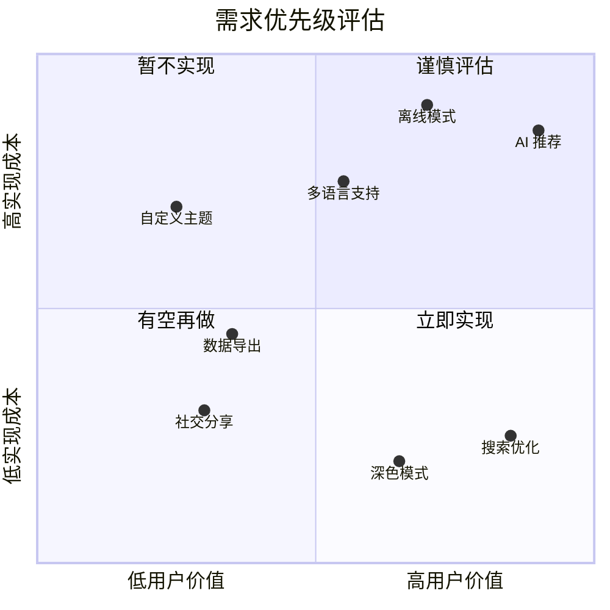
```mermaid
quadrantChart
    title 需求优先级评估
    x-axis "低用户价值" --> "高用户价值"
    y-axis "低实现成本" --> "高实现成本"
    quadrant-1 "谨慎评估"
    quadrant-2 "暂不实现"
    quadrant-3 "有空再做"
    quadrant-4 "立即实现"
    "搜索优化": [0.85, 0.25]
    "深色模式": [0.65, 0.20]
    "社交分享": [0.30, 0.30]
    "多语言支持": [0.55, 0.75]
    "AI 推荐": [0.90, 0.85]
    "数据导出": [0.35, 0.45]
    "自定义主题": [0.25, 0.70]
    "离线模式": [0.70, 0.90]
```

---

## 10. 需求图 RequirementDiagram

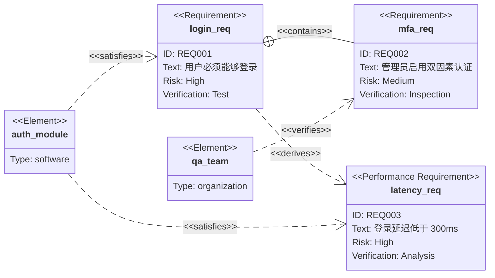
```mermaid
requirementDiagram
    direction LR

    requirement login_req {
        id: REQ001
        text: "用户必须能够登录"
        risk: high
        verifymethod: test
    }

    requirement mfa_req {
        id: REQ002
        text: "管理员启用双因素认证"
        risk: medium
        verifymethod: inspection
    }

    performanceRequirement latency_req {
        id: REQ003
        text: "登录延迟低于 300ms"
        risk: high
        verifymethod: analysis
    }

    element auth_module {
        type: software
    }

    element qa_team {
        type: organization
    }

    login_req - contains -> mfa_req
    login_req - derives -> latency_req
    auth_module - satisfies -> login_req
    auth_module - satisfies -> latency_req
    qa_team - verifies -> mfa_req
```

---

## 11. Git 图 GitGraph

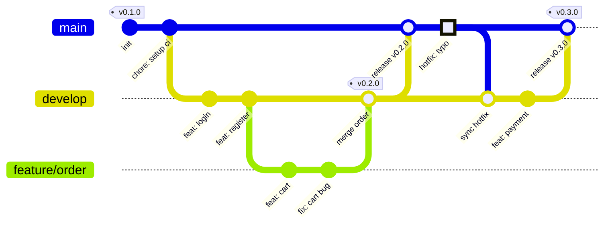
```mermaid
gitGraph
    commit id: "init" tag: "v0.1.0"
    commit id: "chore: setup ci"
    branch develop
    checkout develop
    commit id: "feat: login"
    commit id: "feat: register"
    branch feature/order
    checkout feature/order
    commit id: "feat: cart"
    commit id: "fix: cart bug"
    checkout develop
    merge feature/order id: "merge order" tag: "v0.2.0"
    checkout main
    merge develop id: "release v0.2.0"
    commit id: "hotfix: typo" type: HIGHLIGHT
    checkout develop
    merge main id: "sync hotfix"
    commit id: "feat: payment"
    checkout main
    merge develop id: "release v0.3.0" tag: "v0.3.0"
```

---

## 12. 思维导图 Mindmap

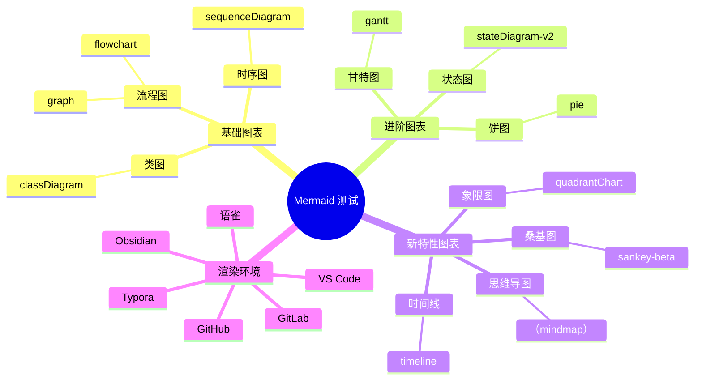
```mermaid
mindmap
  root((Mermaid 测试))
    基础图表
      流程图
        flowchart
        graph
      时序图
        sequenceDiagram
      类图
        classDiagram
    进阶图表
      甘特图
        gantt
      饼图
        pie
      状态图
        stateDiagram-v2
    新特性图表
      思维导图
        （mindmap）
      时间线
        timeline
      象限图
        quadrantChart
      桑基图
        sankey-beta
    渲染环境
      GitHub
      GitLab
      VS Code
      Obsidian
      Typora
      语雀
```

---

## 13. 时间线 Timeline

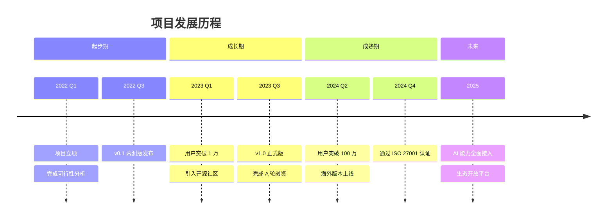
```mermaid
timeline
    title 项目发展历程
    section 起步期
        2022 Q1 : 项目立项
                : 完成可行性分析
        2022 Q3 : v0.1 内测版发布
    section 成长期
        2023 Q1 : 用户突破 1 万
                : 引入开源社区
        2023 Q3 : v1.0 正式版
                : 完成 A 轮融资
    section 成熟期
        2024 Q2 : 用户突破 100 万
                : 海外版本上线
        2024 Q4 : 通过 ISO 27001 认证
    section 未来
        2025 : AI 能力全面接入
             : 生态开放平台
```

---

## 14. 桑基图 Sankey-Beta

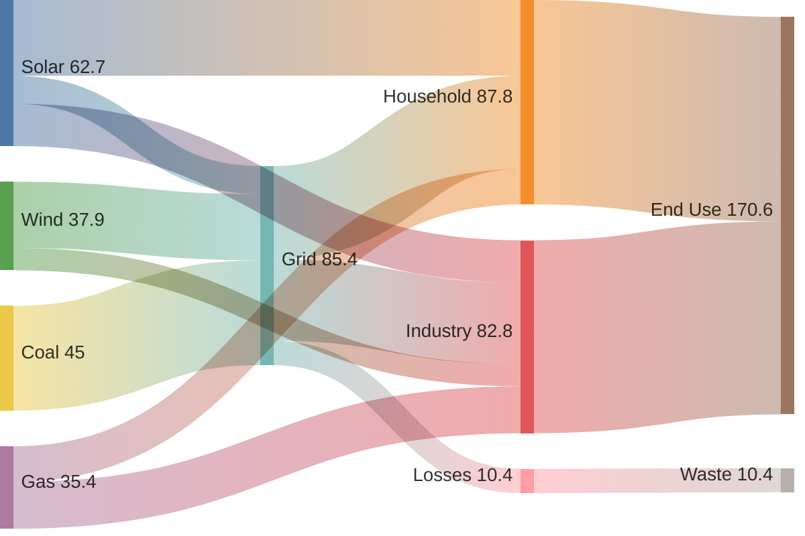
```mermaid
sankey-beta

Solar,Household,32.5
Solar,Industry,18.2
Solar,Grid,12.0
Wind,Grid,28.4
Wind,Industry,9.5
Coal,Grid,45.0
Gas,Household,15.3
Gas,Industry,20.1
Grid,Household,40.0
Grid,Industry,35.0
Grid,Losses,10.4
Household,End Use,87.8
Industry,End Use,82.8
Losses,Waste,10.4
```

---

## 15. XY 图表 Xychart-Beta

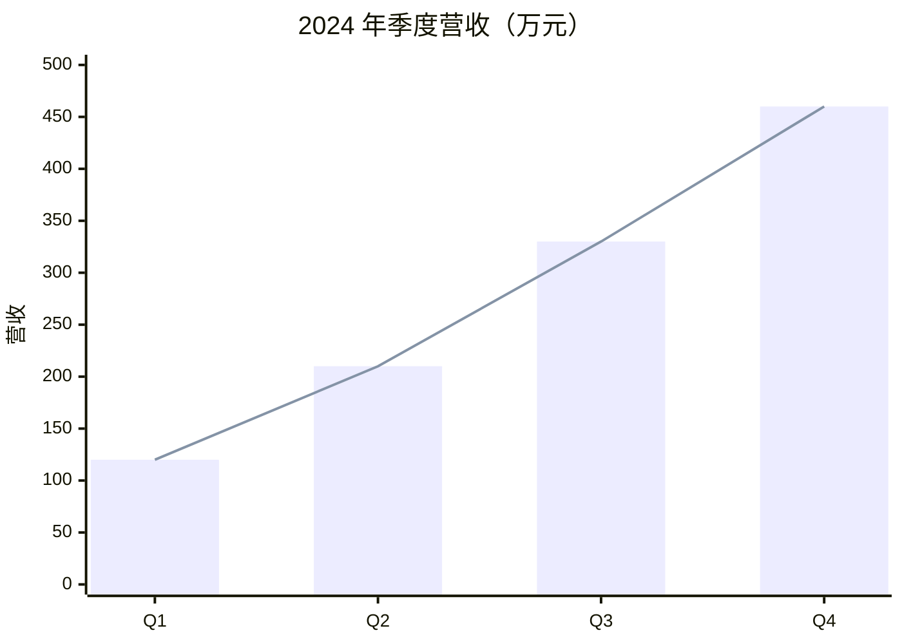
```mermaid
xychart-beta
    title "2024 年季度营收（万元）"
    x-axis [Q1, Q2, Q3, Q4]
    y-axis "营收" 0 --> 500
    bar [120, 210, 330, 460]
    line [120, 210, 330, 460]
```

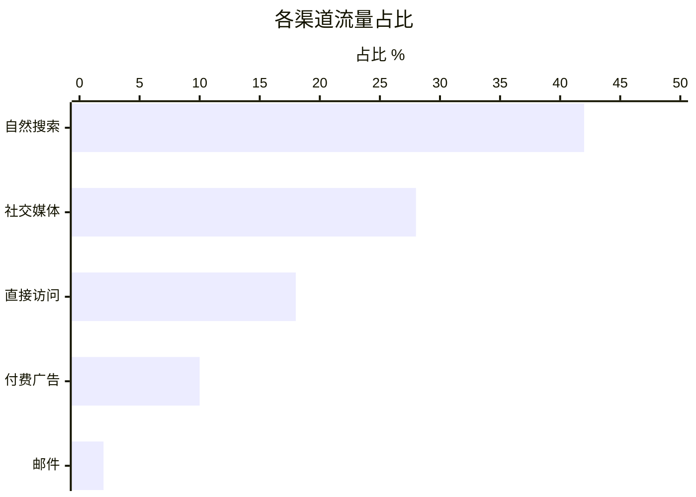
```mermaid
xychart-beta horizontal
    title "各渠道流量占比"
    x-axis ["自然搜索", "社交媒体", "直接访问", "付费广告", "邮件"]
    y-axis "占比 %" 0 --> 50
    bar [42, 28, 18, 10, 2]
```

---

## 16. 块图 Block-Beta

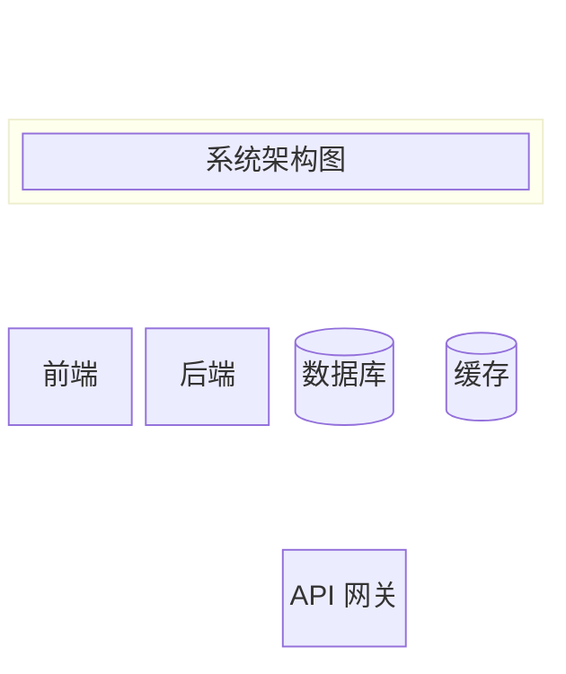
```mermaid
block-beta
    columns 4
    space:4
    block:header:4
        title["系统架构图"]
    end
    space:4
    frontend["前端"] backend["后端"] db[("数据库")] cache[("缓存")]
    space:4
    space:2 gateway["API 网关"] space:1
```

---

## 17. 数据包图 Packet-Beta

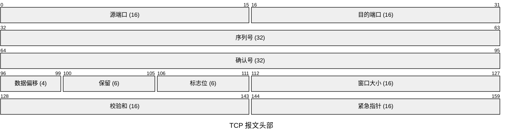
```mermaid
packet-beta
    title TCP 报文头部
    0-15: "源端口 (16)"
    16-31: "目的端口 (16)"
    32-63: "序列号 (32)"
    64-95: "确认号 (32)"
    96-99: "数据偏移 (4)"
    100-105: "保留 (6)"
    106-111: "标志位 (6)"
    112-127: "窗口大小 (16)"
    128-143: "校验和 (16)"
    144-159: "紧急指针 (16)"
```

---

## 18. C4 架构图 C4Context

```mermaid
C4Context
    title 系统上下文图

    Person(user, "普通用户", "使用 Web / App 访问系统")
    Person(admin, "管理员", "负责运营与配置")

    System(sys, "业务系统", "提供核心业务能力")

    System_Ext(pay, "支付网关", "第三方支付服务")
    System_Ext(sms, "短信服务", "验证码与通知")
    System_Ext(sso, "统一认证中心", "SSO 单点登录")

    Rel(user, sys, "使用", "HTTPS")
    Rel(admin, sys, "管理", "HTTPS")
    Rel(sys, pay, "调用支付接口", "HTTPS")
    Rel(sys, sms, "发送短信", "HTTPS")
    Rel(sys, sso, "认证鉴权", "OAuth2")

    UpdateLayoutConfig($c4ShapeInRow="3", $c4BoundaryInRow="1")
```

---

## 19. 综合场景

### 19.1 微服务调用链路

```mermaid
flowchart TB
    Client["客户端<br/>Web / iOS / Android"]

    subgraph GW["接入层"]
        Gateway["API Gateway"]
        Auth["认证服务"]
    end

    subgraph BIZ["业务层"]
        UserSvc["用户服务"]
        OrderSvc["订单服务"]
        PaySvc["支付服务"]
        NotifySvc["通知服务"]
    end

    subgraph MID["中间件"]
        MQ[["消息队列<br/>Kafka"]]
        Redis[("缓存<br/>Redis")]
        ES[("搜索<br/>Elasticsearch")]
    end

    subgraph DATA["数据层"]
        MySQL[("MySQL 主从")]
        OSS[("对象存储")]
    end

    Client --> Gateway
    Gateway --> Auth
    Auth --> Redis
    Gateway --> UserSvc
    Gateway --> OrderSvc
    OrderSvc --> PaySvc
    OrderSvc --> MQ
    PaySvc --> MQ
    MQ --> NotifySvc
    UserSvc --> MySQL
    UserSvc --> Redis
    OrderSvc --> MySQL
    OrderSvc --> ES
    PaySvc --> OSS
    NotifySvc --> Client

    classDef ext fill:#e7f3ff,stroke:#4A90D9,color:#1c4e80
    classDef db fill:#fff4e6,stroke:#e08b28,color:#7a4a0b
    class Client,Gateway ext
    class MySQL,Redis,ES,OSS db
```

### 19.2 发布流程时序

```mermaid
sequenceDiagram
    autonumber
    actor Dev as 开发
    participant Git as Git 仓库
    participant CI as CI 流水线
    participant CD as CD 平台
    participant K8s as K8s 集群
    participant Mon as 监控系统

    Dev->>Git: push feature 分支
    Git->>CI: 触发流水线
    CI->>CI: 代码检查 / 单测 / 构建镜像
    CI->>CI: 推送镜像到 Registry

    Dev->>Git: 合并到 main
    Git->>CD: 触发部署
    CD->>K8s: 灰度发布 10%
    K8s-->>CD: Pod Ready
    CD->>Mon: 观察关键指标
    Mon-->>CD: 错误率 / 延迟正常

    alt 指标正常
        CD->>K8s: 全量发布 100%
        CD-->>Dev: 发布成功通知
    else 指标异常
        CD->>K8s: 回滚到上一版本
        CD-->>Dev: 发布失败告警
    end
```